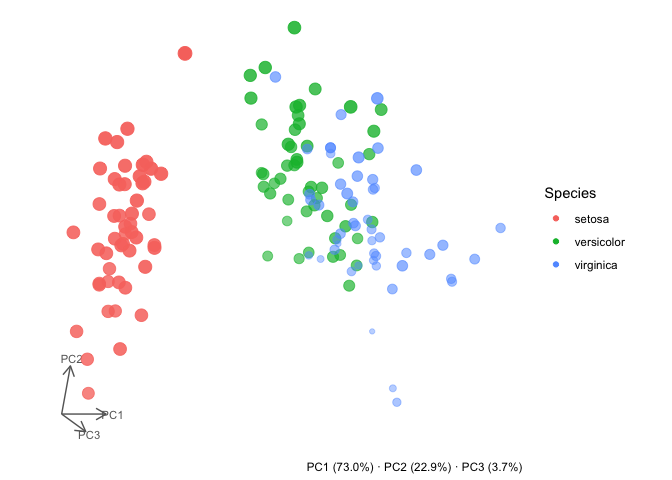
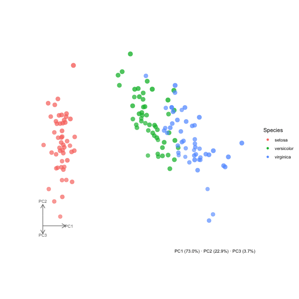

<!-- README.md is generated from README.Rmd. Please edit that file -->

# pca3D

<!-- badges: start -->

[](https://github.com/pascalnoser/pca3D/actions/workflows/R-CMD-check.yaml)
<!-- badges: end -->

pca3D creates 3D-style PCA scatter plots with ggplot2 from a `prcomp`
object, including static views (`plot_pca3d()`) and rotating GIF
animations of a full 360 degree spin (`animate_pca3d()`). Points can be
coloured by metadata columns, any three PC dimensions can be selected,
and variance explained can be annotated automatically.

## Installation

You can install the development version of pca3D from
[GitHub](https://github.com/) with:

``` r
# install.packages("pak")
pak::pak("pascalnoser/pca3D")
```

## Example

A static view with `plot_pca3d()`:

``` r
library(pca3D)

pca <- prcomp(iris[, 1:4], scale. = TRUE)

plot_pca3d(pca, metadata = iris, color_by = Species, axes = "gizmo")
```



And a full rotating GIF with `animate_pca3d()`:

``` r
animate_pca3d(
  pca,
  metadata = iris,
  color_by = Species,
  axes = "gizmo",
  file = "man/figures/README-pca3d.gif"
)
```



For more on customising colours, axes, viewing angle, and dimension
choice, see `vignette("pca3D")` or the function documentation
(`?plot_pca3d`, `?animate_pca3d`).
