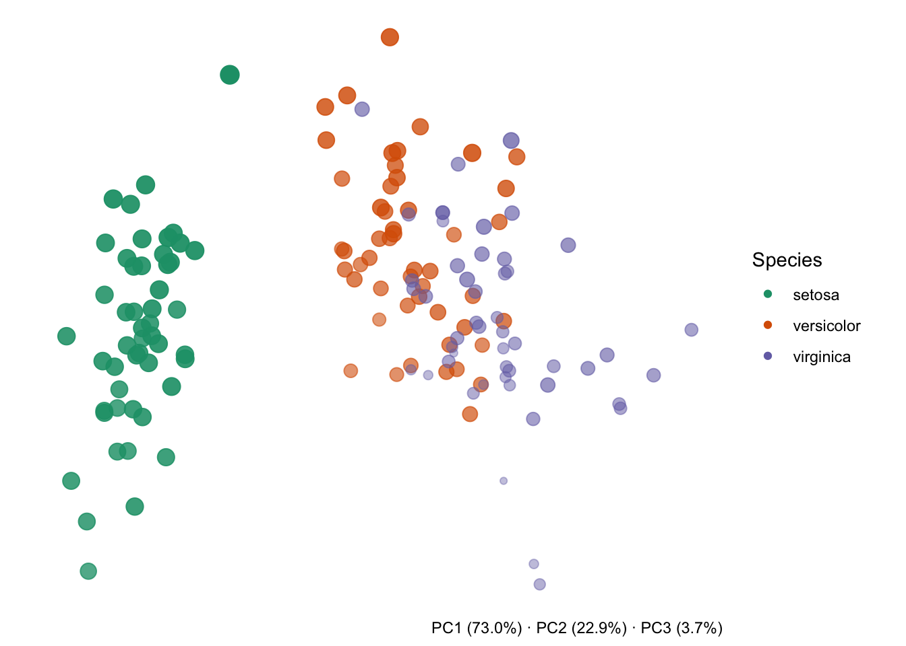
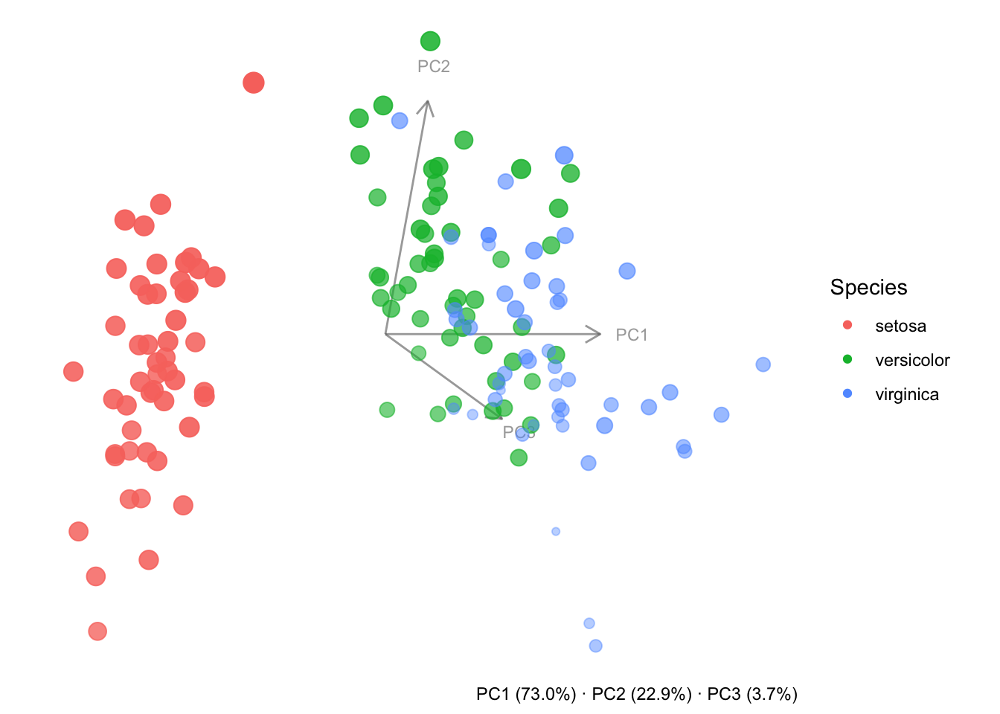
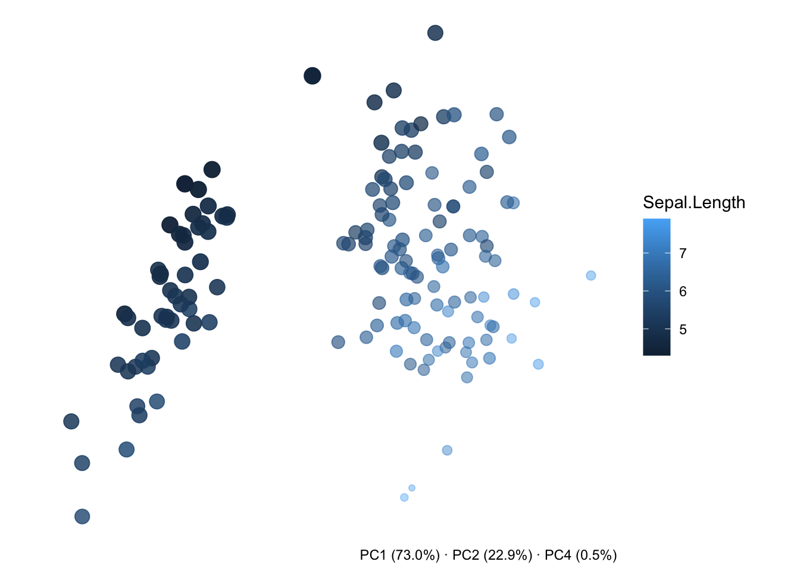

<!-- README.md is generated from README.Rmd. Please edit that file -->

# pca3D

<!-- badges: start -->

[](https://github.com/pascalnoser/pca3D/actions/workflows/R-CMD-check.yaml)
<!-- badges: end -->

pca3D creates 3D-style PCA scatter plots with ggplot2 from a `prcomp`
object, including static views (`plot_pca3d()`) and rotating GIF
animations of a full 360 degree spin (`animate_pca3d()`). Points can be
coloured by metadata columns, any three PC dimensions can be selected,
and variance explained can be annotated automatically.

## Installation

You can install the development version of pca3D from
[GitHub](https://github.com/) with:

``` r
# install.packages("pak")
pak::pak("pascalnoser/pca3D")
```

## Example

``` r
library(pca3D)

pca <- prcomp(iris[, 1:4], scale. = TRUE)

plot_pca3d(pca, metadata = iris, color_by = Species)
```


Because the returned object is a regular `ggplot`, you can customise it
further, e.g. by adding your own colour scale:

``` r
library(ggplot2)

plot_pca3d(pca, metadata = iris, color_by = Species) +
  scale_color_brewer(palette = "Dark2")
```



Set `axes = "full"` (or `"gizmo"`) to show which direction each PC
points, rotating along with the cloud:

``` r
plot_pca3d(pca, metadata = iris, color_by = Species, axes = "full")
```



Colouring by a continuous variable, picking a different set of PCs, and
changing the viewing angle works the same way:

``` r
plot_pca3d(pca, dims = c(1, 2, 4), metadata = iris, color_by = Sepal.Length, theta = 45, phi = 30)
```



To see the same point cloud from every angle, save a rotating GIF with
`animate_pca3d()`. Since the result is a rendered GIF rather than a
`ggplot` object, you can’t customise the colour scale by adding to it
afterwards – instead, build the scale first and pass it via
`color_scale`:

``` r
animate_pca3d(
  pca,
  metadata = iris,
  color_by = Species,
  axes = "gizmo",
  color_scale = scale_color_brewer(palette = "Dark2"),
  file = "man/figures/README-pca3d.gif"
)
```


